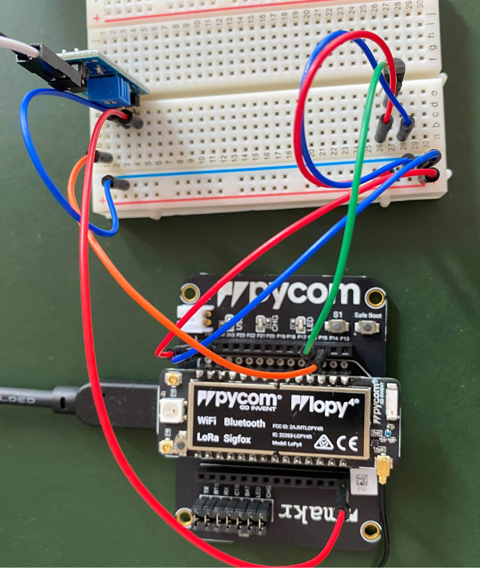

# iot_plant_project
By: Mathilda Moström mm224ph

# Project description
I love plants, and especially my own. To keep my beloved friends happy and healthy, I choose for my first IoT project to build a system that keeps track of how moist the solid material is. I also want to keep track of the temperature to indicate how much sunlight they get . So the idea of this project is to be able to collect data from the two sensors (soil humidity and room temperature) and then make the data visible in Ubidots. Data can then be used to gain a better understanding of the specific needs of the different plants.

Estimated time for this project is based on previous experience about 3 hours. It is installation and installation of different programs that takes time, the project itself is really beginner friendly.

# Objective
From my great interest in plants and data, it became an obvious *choice* to build something before this course that helps me keep track of my plants' needs. After looking around on different pages for different sensors and getting some inspiration from projects that were done last year, I chose to collect data on how moist the plants are and what temperature they are in. The *purpose* is to become better at taking care of the plants and that identify different needs they have, which ones can handle higher / lower temperatures, and how quickly they become dehydrated. Tracking this will give me better *insights* into how I best take care of my plants.

# Material
I bought all my material from Electrokit. 
### LoPy4 and sensors bundle (LNU-1DT305)
This is a kit which is developed for this course and which contains most of what you need to get started with similar projects, then you can buy more sensors depending on what you want to do, the kit contains:
– LoPy4 with headers
– Expansion board
– Antennae
– Micro USB cable
– Jumper wire
– Breadboard
– 10 x Resistor1 kohm
– 10 x Resistor 10 kohm
– 10 x Resistor 330 ohm
– 10 x Resistor 560 ohm
– 5 x LED red
– 5 x LED orange
– 5 x LED green
– 2 x LDR
– Tilt switch
– Temperature sensor MCP9700
– Hall-effect sensor TLV49645
– Magnet

For this project I have used the LoPy4, the expansion board, the antennae, the micro USB cable and the temperature sensor MCP9700. 

### Soil hygrometer module (41015738)
This is a sensor for measuring the moisture level in soil. The sensor works by passing a current from one leg to the other, if the resistance is high it means that the soil is dry and vice versa.


| Item       | Quantity | Price   | Link |
| :----------: | :--: | :----: | :------:|
| LoPy4 and sensors bundle | 1 | 949.00 kr | https://www.electrokit.com/produkt/lnu-1dt305-tillampad-iot-lopy4-and-sensors-bundle/ |
| Soil moisture sensor | 1 | 29.00 kr | https://www.electrokit.com/produkt/jordfuktighetssensor/ |

# Computer setup
The first thing you do is to update the firmware of your expansion board. I did this on my Mac but it should work fine on any machine (Ubuntu, Windows). Nex step is to download the Pycom Device Firmware Updater and follow the installation setup found on: ``` https://docs.pycom.io/pybytes/gettingstarted/ ```. Now we are all set to connect the LoPy4 and the extensionboard with the mirco-USB cable to your computer.  

I choose to use Visual Studio Code as editor for this project, download the extension Pymakr. If everything worked smoothly you are now ready to type some code and upload it. 

# Putting everything together
First of all, disconnect your device from your computer. The first to cables we want to connect is one read to VND and one blue to GND on the PyCom device and then connect these to the breadboard one red(+) and the other one to blue(-). Then its time to connect the temperature sensor, its three legs should all be connected to the breadboard (please se more in detail in the picture below). Then you also need a cable from the middle leg in the sensor from the breadboard connected to P16 in the PyCom device, also connect to power and GND on the breadboard. It can be a good start to now connect everything to your computer and set up a small example code to see soo everything runs as expected and that you get relevant temperature data, try to cover the sensor with your fingers and see soo it works as expected. When you are done it's time to connect the next sensor. Start with to connect the sensor to the breadboard, connect GND to the breadboard itself and power to P12 on the PyCom device. Then you connect on cable from the breadboard to P15 on the PyCom device (again see picture below).



# Platform
The data is presented in Ubidots, I chose this alternative since I like the features it provides and that it's free for educational use. Ubidots is cloud-based. Ubidots also provides events so you can get for example notifications through text or email, they even have a mobile app for android soo you can see your dashboards easily anytime. The free version has a limit on how much data you can send every day, in my case this is not a problem since I don't need to send data that frequently. 

# The code

### boot.py
[](img/boot.png)
boot.py is used first to initialise the connection to the LoPy4 and the wifi.

### main.py
[](img/main.png)
[](img/main_whiel.png)
main.py is where I read the data from the sensors and send the data to Ubidots.

### constants.py
[](img/constants.png)

# Transmitting the data / connectivity

# Presenting the data

# Finalizing the design
